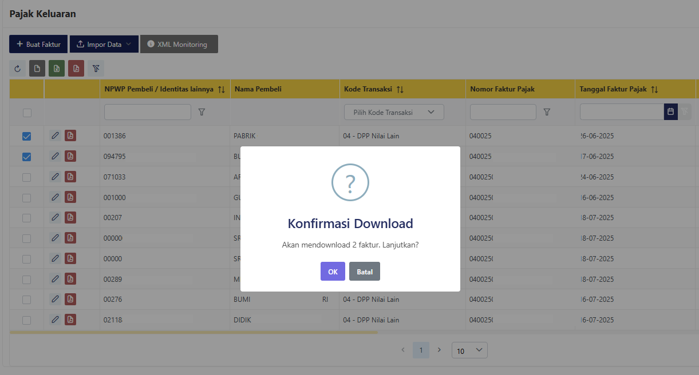

# CoreTax PDF Downloader (Edge, Chrome & Firefox Extension) 🇮🇩

**CoreTax PDF Downloader** adalah ekstensi peramban untuk Google Chrome/Chromium-based browsers dan Mozilla Firefox yang membantu pengguna mengunduh PDF dari situs resmi Direktorat Jenderal Pajak (https://coretaxdjp.pajak.go.id/) dengan lebih cepat, mudah, dan praktis.

---

## ✨ Fitur Utama

- 🧾 **Download Dokumen Pajak otomatis** dalam format PDF
- 💡 Antarmuka ringan dan intuitif
- 🔒 Semua proses dilakukan *lokal di perangkat* (tidak ada data pribadi yang dikirim keluar)
- 📊 Progress bar interaktif selama proses download
- ❤️ Dukungan donasi via QRIS (opsional)

---

## 🛠️ Instalasi

- [Mozilla Add-ons (AMO)](https://addons.mozilla.org/addon/free-coretax-faktur-downloader/)  
- [Chrome Web Store](#) *(link akan diperbarui setelah publikasi)*
- [Edge Add-ons](#) *(link akan diperbarui setelah publikasi)*

---

## 📥 Cara Menggunakan

1. Login ke [https://coretaxdjp.pajak.go.id/](https://coretaxdjp.pajak.go.id/) seperti biasa.
2. Navigasi ke halaman daftar faktur atau bukti potong.
3. Pilih faktur atau bukti potong yang ingin diunduh.
4. Klik ikon ekstensi **CoreTax PDF Downloader** di toolbar browser.
5. Dokumen PDF akan terunduh otomatis.

📌 *Pastikan Anda sudah berada di halaman faktur/bukti potong sebelum menekan tombol download.*

---

## ⚠️ Catatan Penting

Agar proses download berjalan lancar, **nonaktifkan fitur buka otomatis PDF di browser**.  
Jika tidak, browser akan membuka tab baru untuk setiap faktur/bukti potong yang diunduh.

### 🦊 Firefox
1. Buka **Menu (☰) → Settings**  
2. Masuk ke **General → Applications**  
3. Cari **Portable Document Format (PDF)**  
4. Ubah aksinya menjadi **Save File**  

### 🌐 Chrome / Edge
1. Buka `chrome://settings/content/pdfDocuments` di address bar  
2. Aktifkan opsi **Download PDFs** (jangan buka otomatis di browser)  

---

## 🧾 Contoh Tampilan

---

## 🔐 Privasi

Ekstensi ini tidak mengumpulkan, menyimpan, atau mengirimkan data pribadi.  
Semua proses berjalan secara lokal di perangkat Anda.  
Detail lengkap: [Privacy Policy](Privacy-Policy.md)

---

## 💻 Teknologi yang Digunakan

- HTML, CSS, JavaScript
- Chrome Extension API / WebExtension API
- SweetAlert2 (popup ramah pengguna)
- QRCode.js (untuk menampilkan QRIS donasi)

---

## 📂 Struktur Repositori

- `DOF-Downloader-chrome` → kode sumber untuk Google Chrome 
- `PDF-Downloader-mozilla` → kode sumber untuk Mozilla Firefox  
- `PDF-Downloader-edge` → kode sumber untuk Microsoft Edge  
- `Privacy-Policy.md` → kebijakan privasi  

---

## 🧾 Lisensi

MIT License © 2025 Mabaega  

Ekstensi ini juga menyertakan library pihak ketiga:  
- [SweetAlert2](https://sweetalert2.github.io/) (MIT)  
- [QRCode.js](https://github.com/davidshimjs/qrcodejs) (MIT)  

---

## 📬 Kontak & Dukungan

Untuk pertanyaan, laporan bug, atau saran, silakan hubungi:  
📧 [mabaega@gmail.com](mailto:mabaega@gmail.com)

Jika ekstensi ini bermanfaat, Anda dapat mendukung pengembang melalui QRIS yang tersedia di dalam ekstensi 🙏

---

